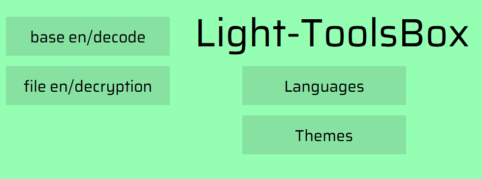

# Light-ToolsBox
[English](./README.md) | [简体中文](./README-zh-CN.md)
## 介绍
一个基于[Python3](https://www.python.org/)的工具箱，里有许多小工具。

## 使用
- 源码编译
- release运行
### 源码编译
- 编译依赖
- 常见问题
### 编译依赖
[Python3](https://www.python.org/)安装  
首先：`cd 你的Light-ToolsBox储存路径`  
库安装:  `pip3 install -r requirements.txt`  
编译: `python3 Light-ToolsBox.py`  
### 常见问题
- 运行报错。
  - 检查是否安装了Python3。
  - 检查是否安装了依赖库。
  - 检查安装Python3时是否安装了pip3
  - 检查是否在Light-ToolsBox目录下运行。
  - 检查文件缺失
  - 检查文件格式
### release运行
- 运行
- 常见问题
### 运行
- 打开下载的release
- 运行.exe的程序
### 常见问题
- 运行报错
  - 检查是否在Light-ToolsBox目录下运行。
  - 检查文件缺失
  - 检查文件格式
## 工具
- base 编/解码
- 文件（夹）加/解密
### base 编/解码
- 功能
- 使用
- 常见问题
### 功能
- 编/解码
- 编码：将文本转换base85、base64、base32、base16等编码
- 解码：将编码后的文本转换回原文本
### 使用
- 第一个选择框用于选择编码类型。  
- 在输入框内输入需要编码或解码的文本。  
- 点击“编码”或“解码”按钮进行编码或解码。  
- 点击“复制”可以将输出的文本复制到剪贴板。
- 若编码格式不规范，解码时会提示错误，输出框里显示“error”。  
### 常见问题
- 解码错误
  - 检查编码类型是否正确。
### 文件（夹）加/解密
- 功能
- 使用
- 常见问题
### 功能
- 加/解密
- 加密：对文件或文件夹进行加密
- 解密：对加密后的文件进行解密，文件夹不可直接解密，需要解密文件加加密后输出.base64文件，在解压成文件夹。
### 使用
- 第一个选择框用于选择加密/解密的是文件夹还是文件。
- 点击“选择”按钮选择需要加密/解密的文件或文件夹。
- 点击“打开按钮”则打开输出的文件的父目录。
- 点击“加密”或“解密”按钮进行加密/解密。
### 常见问题
- 解密错误
  - 检查加密文件是否正确。
## 常见问题
字体不对，请安装./font/cmdysj.ttf字体。
